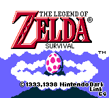

# The Legend of Zelda: Survival (Legacy Version)

this name can change later, but in a shorter way:
Zelda Survival is a survival game, using the The Legend of Zelda: Link's Awakening sprites (because they are amazing)

**UPDATE!:** the game's name now is *The Legend of Zelda: a Link's Survival*...yeah, very creative name

**BIG CHANGE!:** This specific version (web version) became the *Legacy Edition*, cuz the main version became the love2d version
but this version will continue to receive updates until it hits **1.0.0**, together with the main version, that will became a entire new game

**ANOTHER UPDATE** this version was cancelled until next notice

# ITS BACK!!1!

# VERSIONS:

my idea is make this game have a LOT of alternative versions, being on my mind these versions:

- Web game version: this version
- GBC version : I want A LOT to make a port to the Gameboy Color, because how u know, the original game was made on the original Gameboy (and after it get a remake to the Gameboy Color)
- PC Executable Version (Love 2D): I hate web development, and I'm very limited on what I can do using HTML and Javascript only, so I've decided to redo my entire game in love2d, which ended becaming the main version (which i wouldn't say that it wasn't in the plans cuz it was but would take more time to became it), but despite that, the love2d version will became a entire new game with its own story, lore, characters and more, and the legacy will continue to be the Zelda Survival, that Im thinking in make a texture pack of the sprites and textures and distribute for free 4 my friends and a specific group
- DS version: yes
